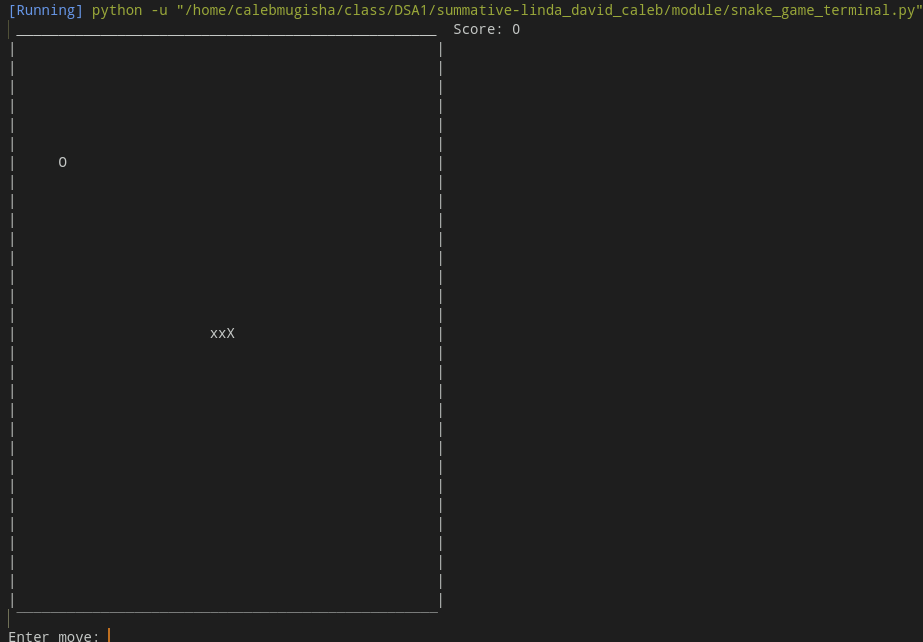
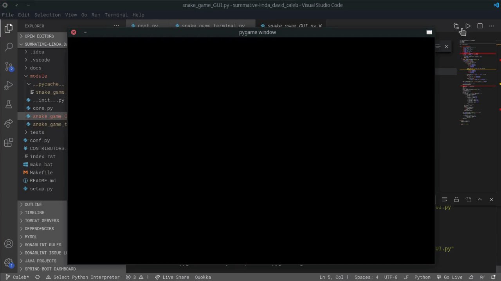

# summative-linda_david_caleb
summative-linda_david_caleb created by GitHub Classroom

Project Description

Our project will be focused on the A* pathfinding algorithm. Our objective is to guide the snake towards the target(our food) by going throught the shortest path posible. The snake will increase in length and gain one point after each successful reach.

A* Algorithm

in order to understand how this algorithm works it's important to consider a 2D grid with cells, having a starting point and a destination point, our goal here is to find the shortest path to reach to the destination.

What A* Search Algorithm does is that at each step it picks the node/cell according to a value-‘f’ which is a parameter equal to the sum of two other parameters – ‘g’ and ‘h’. At each step it picks the node/cell having the lowest ‘f’, and process that node/cell.

g - the movement cost from moving from the initial cell to any cell on the grid as long as it's in the path to the destination.
h - the estimated movement cost to move from that given square on the grid to the final destination. this usually a guess since at first we don't know the actual distance until we find the path to the destination.

          
     Testing Effectiveness
     
So how would we know that the algorithm we used was effective? To analyze its optimality, we can use either of this 2 methods: 
Points
The snake gets one point upon successful reaching of its target. This increments as the game proceeds. The more points, the longer the snake lasted, and so the better the solution is at avoiding crashes while also collecting points. How many points the snake collects will be a great indication of how successful we implemented.

Motivation

As we move deeper into the digital age, there is a need to automate most tasks that we handle manually. This has already been seen in game development, and has extended in our day to day activities such as: in GPS navigation systems, using A* in finding all the neighbouring locations, and in social networks, where we can find people within a given distance ‘k’ from a person using path finding till ‘k’ levels. 
       
Applications

 This general problem of finding a path from a starting point to an endpoint can be applied to lots of other applications like satellite navigation, routing packets across the internet, game AIs, OS file system search, distribution/utility networks and many more.
 
 
 In developing our Game we went through phases
 
 1.First Prototype
     This is a terminal based game, not having lots of functionality. the snake is moved using the S,A,D,W keys.
 
 
 
 2.Second Prototype
     This is a more improved version of the game with a Graphical User Interface. it uses the navigation keys for direction.
 
 

  3. Final Product
     This reflects an automated version of the snake game using the A* Algorithm, no user input is needed at all.

 
 
 
 In order to run this application you must install NumPy
                   *pip install numpy
 
Bibliography

GreatLearning Blog: Free Resources what Matters to shape your Career!. 2021. Best First Search Algorithm in AI | Concept, Algorithm and Implementation. [online] Available at: <https://www.mygreatlearning.com/blog/best-first-search-bfs/> [Accessed 7 April 2021].
Jeulin-Lagarrigue, M., 2021. Breadth First Search (BFS) Pathfinder - Algorithms | H.urna Academy. [online] H.urna. Available at: <https://hurna.io/academy/algorithms/maze_pathfinder/bfs.html> [Accessed 7 April 2021].
Prep, F., 2021. Applications of Breadth First Traversal. [online] FACE Prep. Available at: <https://www.faceprep.in/data-structures/applications-of-breadth-first-traversal/> [Accessed 7 April 2021].
GeeksforGeeks. 2021. A* Search Algorithm - GeeksforGeeks. [online] Available at: <https://www.geeksforgeeks.org/a-search-algorithm/> [Accessed 21 March 2021].
 
